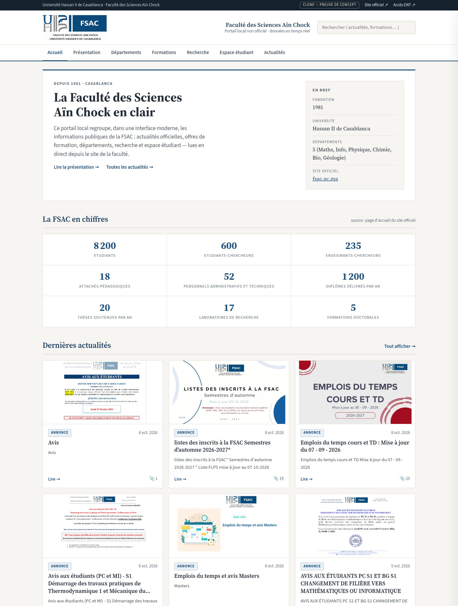
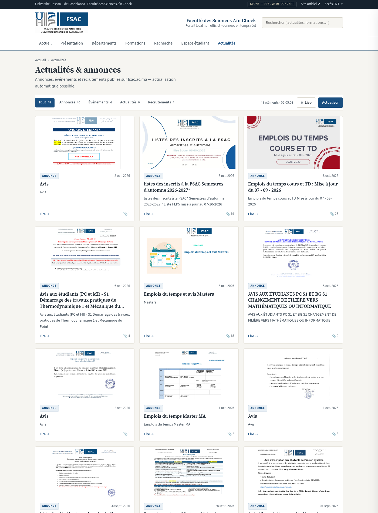
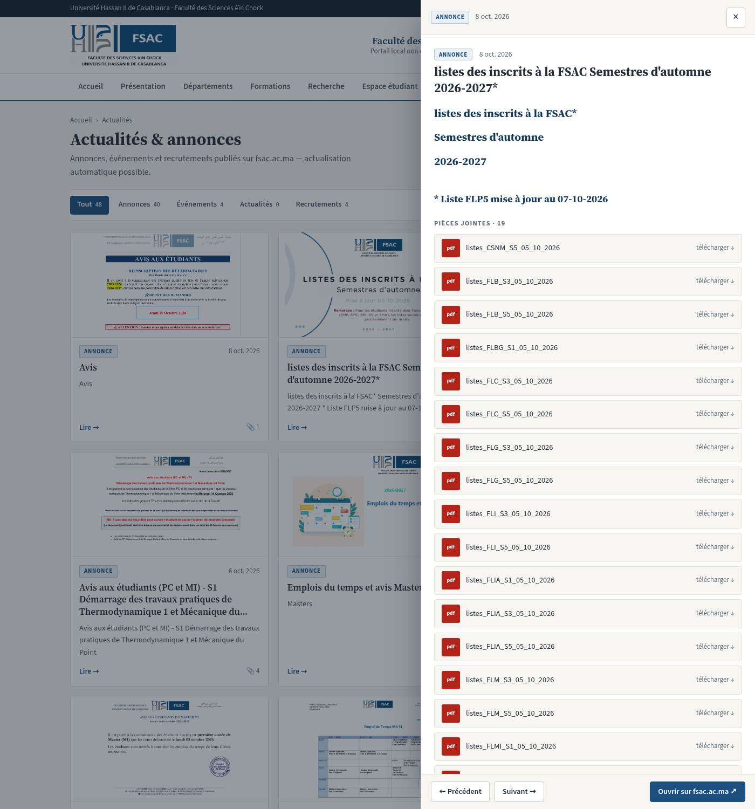
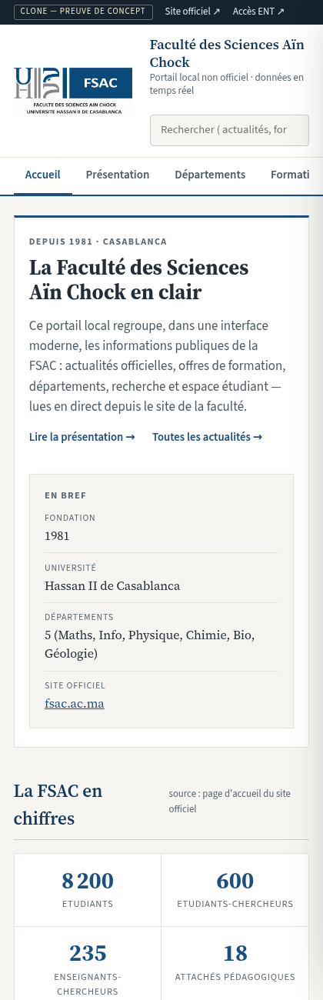

# FSAC Wrapper

> A localhost mirror of the FSAC faculty website — real-time data, academic UI, zero fluff. A hobby PoC, not an official service.

[](LICENSE)
[](https://www.python.org/downloads/)
[](https://fastapi.tiangolo.com/)
[](#disclaimer)
[](#tests)

A Python/FastAPI wrapper that re-presents the public data of the [Faculté des Sciences Ain Chock](https://fsac.ac.ma) (`fsac.ac.ma` → `fsac.univh2c.ma`) through a clean, modern, self-hosted interface — live announcements, department pages, statistics, and attachments, fetched on demand and cached politely.

```
  fsac.univh2c.ma  ──WS.php JSON──►  FastAPI wrapper  ──►  http://127.0.0.1:8000
  (upstream source)                  (this project)         (your browser)
```

---

## Disclaimer

**This is an unofficial hobby project** — a proof-of-concept clone built for learning. It is **not** affiliated with, endorsed by, or operated by Faculté des Sciences Ain Chock or Université Hassan II de Casablanca. All content, logos, and data belong to the official site; this wrapper merely re-serves public information with attribution and links back to `fsac.ac.ma`. For anything official (inscriptions, documents, exams), **always use the real site**.

---

## Features

- **Live feed** — announcements, events, actualités & recruitments from the upstream `WS.php` API, refreshed automatically (60s TTL cache)
- **Full article drawer** — every attachment (PDF lists, avis, emplois du temps) with one-click download and a "open on fsac.ac.ma" escape hatch
- **Static content pages** — Présentation, Départements, Formations, Recherche, Espace étudiant, rendered from the site's own `static_pages/*.json`
- **Live statistics** — student/researcher/teaching counts scraped from the official homepage, with animated counters
- **Academic UI** — institutional blue (`#1a4f80`), Source Serif / Source Sans typography, paper-like light theme, responsive down to mobile
- **Safe media proxy** — upstream images/attachments hotlinked through an allowlisted proxy (no foreign hosts)
- **Zero tracking, zero cookies** — it's a localhost tool

---

## Screenshots

| Home | Actualités & annonces |
|:---:|:---:|
|  |  |

|  Article drawer (19 PDF attachments) |
|  |

| Mobile (420px) |
|:---:|
|  |

---

## Quick Start

### Option 1: One-shot launcher (recommended)

```bash
git clone https://github.com/Exo-del/fsac-wrapper.git
cd fsac-wrapper
./run.sh          # creates .venv, installs deps, copies .env.example → .env, starts
```

Open **http://127.0.0.1:8000** — done.

### Option 2: Manual venv

```bash
git clone https://github.com/Exo-del/fsac-wrapper.git
cd fsac-wrapper
python3 -m venv .venv
source .venv/bin/activate
pip install -r requirements.txt
python runner.py  # or: uvicorn app:app --host 127.0.0.1 --port 8000
```

### Option 3: Docker-style (plain uvicorn, any env)

```bash
pip install fastapi "uvicorn[standard]" httpx beautifulsoup4 lxml pydantic python-dotenv
uvicorn app:app --host 127.0.0.1 --port 8000
```

> First run fetches from upstream — allow a few seconds for cold caches. Subsequent requests are served from the in-memory TTL cache.

---

## API Reference

All endpoints return JSON. Content is fetched live from `https://fsac.univh2c.ma` and cached.

| Endpoint | Description |
|----------|-------------|
| `GET /api/health` | Service + upstream status |
| `GET /api/feed?kind=&nb=&from=` | Normalized feed (annonces, events, actualités, recrutements) |
| `GET /api/article/{kind}/{id}` | Full article: sanitized HTML, attachments, prev/next links |
| `GET /api/stats` | Homepage statistics (étudiants, chercheurs, laboratoires…) |
| `GET /api/nav` | Site navigation menu (from `global.json`) |
| `GET /api/pages` | Static page index (5 pages, part counts) |
| `GET /api/pages/{slug}` | Full static page (`presentation`, `departements`, `formations`, `recherche`, `espace_etu`) |
| `GET /api/proxy?url=` | Allowlisted media proxy (FSAC hosts only) |
| `GET /api/cache/clear` | Flush all caches |
| `GET /api/meta` | Upstream origin, TTLs, cache stats |

Example:

```bash
curl -s 'http://127.0.0.1:8000/api/feed?nb=5' | python3 -m json.tool
curl -s 'http://127.0.0.1:8000/api/pages/presentation' | python3 -m json.tool
```

---

## Frontend Routes

Single-page app, hash-based — no build step, no framework:

| Route | View |
|-------|------|
| `#/` | Home — intro, live stats, 9 latest items |
| `#/actualites` | Full feed with kind tabs + search + live refresh |
| `#/page/{slug}` | Content page with sticky sub-navigation |
| `#annonce/{id}` | Deep link that opens the article drawer |

---

## Architecture

```
Browser (static/index.html + app.js, hash router)
    │  fetch /api/*
    ▼
FastAPI (app.py) ── pydantic models (fsac/models.py)
    │
    ├─ fsac/client.py   httpx + TTL cache ──► WS.php?action=…   (feed/articles/stats)
    ├─ fsac/pages.py    static_pages/*.json normalization
    └─ fsac/normalize.py sanitizer + FSAC URL resolution + allowlisted proxy
```

- **Caching:** 60s for API calls, 600s for the scraped homepage — polite to upstream, snappy for you
- **Sanitization:** upstream HTML is stripped to safe tags; all media URLs are rewritten through the local proxy
- **No database, no auth, no telemetry** — stateless by design

---

## Repository Structure

```
.
├── app.py                 # FastAPI app — all API routes
├── config.py              # env-driven config (origin, TTLs, proxy)
├── runner.py              # launcher (uvicorn on 127.0.0.1:8000)
├── run.sh                 # one-shot: venv + deps + .env + start
├── fsac/
│   ├── client.py          # httpx client + TTL caches + WS.php calls
│   ├── models.py          # pydantic response models
│   ├── normalize.py       # HTML sanitizer + proxy URL rewriting
│   └── pages.py           # static_pages JSON → structured parts
├── static/
│   ├── index.html         # shell: utility bar, masthead, nav, footer
│   ├── css/styles.css     # academic theme (blue #1a4f80, serif headings)
│   ├── js/app.js          # hash router, feed, drawer, search, live mode
│   └── img/FSAC-logo.jpg  # official logo (hotlinked copy, fair-attribution)
├── assets/                # README screenshots
├── tests/test_smoke.py    # 9 end-to-end smoke tests
├── .env.example
├── requirements.txt
└── LICENSE
```

---

## Configuration

Copy `.env.example` → `.env` (the launcher does this for you):

| Variable | Default | Description |
|----------|---------|-------------|
| `FSAC_ORIGIN` | `https://fsac.univh2c.ma` | Upstream origin |
| `CACHE_TTL` | `60` | API cache TTL (seconds) |
| `HOME_CACHE_TTL` | `600` | Homepage scrape cache TTL |
| `REQUEST_TIMEOUT` | `12` | Upstream HTTP timeout (seconds) |
| `ENABLE_PROXY` | `true` | Media/attachment proxy |

---

## Tests

```bash
pip install -r requirements-dev.txt
pytest -q
```

| Test | Checks |
|------|--------|
| `test_health` | Service + upstream reachability |
| `test_feed_shape` | Feed normalization (kinds, dates, ids) |
| `test_article_detail` | Full article + attachments + prev/next |
| `test_stats` | Homepage stats scrape |
| `test_nav` | Menu from `global.json` |
| `test_cache_roundtrip` | TTL cache behavior |
| `test_proxy_rejects_foreign_host` | Proxy allowlist security |
| `test_pages_index` | Static pages index |
| `test_pages_detail` | Full static page content |

> Tests hit the live upstream — they need internet access.

---

## Upstream Notes

Quirks of the real site that this wrapper absorbs for you:

- `www.fsac.ac.ma` 302-redirects to `fsac.univh2c.ma` — the wrapper targets the latter directly
- `WS.php` uses **`prev_id` = older item, `next_id` = newer** — the feed order is the source of truth
- Cross-kind lookups (`annonce` vs `event` vs `actu` vs `recrut`) resolve via the item's own `TYPE` code (`AN`/`EV`/`AC`/`RH`)
- `presentation` and `espace_etu` JSON contain invalid UTF-8 — decoded with `errors="replace"`
- Some upstream images use relative paths — rewritten through the allowlisted proxy

---

## License

MIT — see [LICENSE](LICENSE)

Logo and content © Faculté des Sciences Ain Chock / Université Hassan II de Casablanca — used here with attribution, non-commercially, linking back to the official site.

---

## Citation

```bibtex
@software{fsac-wrapper,
  title = {FSAC Wrapper: Localhost Mirror of the FSAC Faculty Website},
  author = {Alouhmy, Mohamed},
  year = {2026},
  url = {https://github.com/Exo-del/fsac-wrapper}
}
```

---

## Links

- **Official site:** https://fsac.ac.ma
- **Issues:** https://github.com/Exo-del/fsac-wrapper/issues

---

**Built for learning, not for impersonation. When it matters, use the real site.** 🎓
